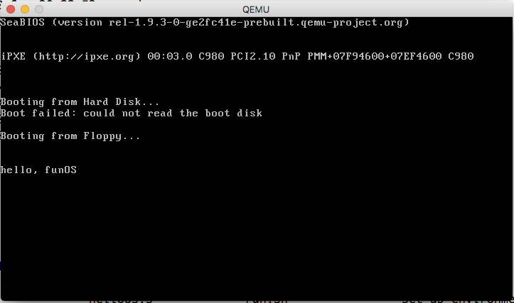

# macOS Sierra 环境搭建

首先，macOS Sierra 完全支持《30天自制操作系统》所需要的开发环境。之前配置环境的时候查了很多资料，基本上都比较麻烦，总结了一个相对比较简便的方案。

需要的工具主要有以下：

1. 作者提供的工具包
2. qemu 模拟器

作者提供的工具包可以在[书的官网](http://shrimp.marokun.net/osakkie/wiki/tolsetOSX/)下载。

我自己上传了一份到 [Google Drive](https://drive.google.com/open?id=0B1TQzOLw2hpKdFU0RkNJZzhsUDA)

#### qemu 模拟器

安装 qemu 模拟器可以直接通过 **brew** 命令安装。

```shell
brew update
brew qemu
```

首先把 brew 升级到最新版本， **brew** 会自动根据系统版本选择依赖的第三方库版本。


#### 测试

用 day1 的代码测试下当前的环境。假定已经完成了 day1 的代码，并且保存在名为 **helloos.s** 的文件中，此处使用 s 的后缀主要是为了 **vim** 中的语法高亮。

首先执行如下命令将编译结果写入到 **image** 文件中。

```shell
./z_tools/nask helloos.s helloos.img
```

然后，利用 **qemu** 模拟器启动系统。

```shell
qemu -fda helloos.img
```

最终运行效果如下图所示，即说明环境已经成功搭建好。




